# Flow — faster-payment

Generated by `agent-layer/gen-build-handoff.mjs` from `build/ops.jsonl` (#314). Regenerated, never hand-edited: a hand edit is lost. Lane A is the document; every other lane is its differences on A (G33).

## Composition over admission

- Composed and named: 0 group(s), 0 placed copies.
- Admitted through the chain: 1 (1 from imports, 0 from promoted groups).

A promoted group that is ratified counts in both lines (PRD § Success metrics, "Composition over admission" — reported, no target).
- Parts by provenance: 0 imported · 0 admitted · 0 composed · 26 vocabulary.

## Decisions changed since linked

- None — every linked decision is the latest on its question.

## Lane A (base)

```mermaid
stateDiagram-v2
  f1 : add-payee
  f2 : error of add-payee
  f3 : payee-name-check-result
  f4 : empty of payee-name-check-result
  f5 : error of payee-name-check-result
  f6 : partial of payee-name-check-result
  f7 : loading of payee-name-check-result
  f8 : close-match of payee-name-check-result
  f9 : no-match of payee-name-check-result
  f10 : unavailable of payee-name-check-result
  f11 : scam-safety-stop
  f12 : empty of scam-safety-stop
  f13 : error of scam-safety-stop
  f14 : partial of scam-safety-stop
  f15 : loading of scam-safety-stop
  f16 : send-payment
  f17 : empty of send-payment
  f18 : error of send-payment
  f19 : partial of send-payment
  f20 : loading of send-payment
  f21 : pending of send-payment
  f22 : success of send-payment
  f23 : fail of send-payment
  f24 : empty of add-payee
  f25 : partial of add-payee
  f26 : loading of add-payee
  f1 --> f2 : tapping Continue, when Confirmation of Payee returns a non-match
```

- From add-payee (f1), tapping Continue goes to error of add-payee (f2), when Confirmation of Payee returns a non-match.

Missing states (the floor is ideal · empty · error · partial · loading, plus any state a screen declares):

- None — every screen in this lane has every state it requires.
