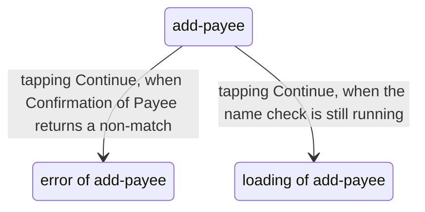
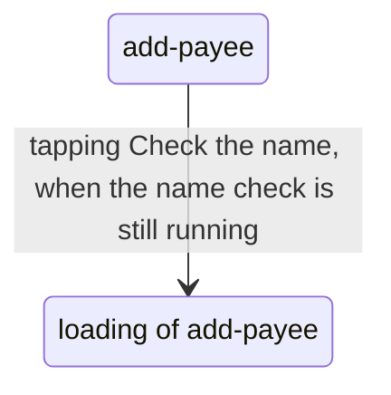

# Flow — two-lane

Generated by `agent-layer/gen-build-handoff.mjs` from `build/ops.jsonl` (#314). Regenerated, never hand-edited: a hand edit is lost. Lane A is the document; every other lane is its differences on A (G33).

## Lane A (base)

- From add-payee (f1), tapping Continue goes to error of add-payee (f2), when Confirmation of Payee returns a non-match.
- From add-payee (f1), tapping Continue goes to loading of add-payee (f3), when the name check is still running.

Missing states (the floor is ideal · empty · error · partial · loading):

- add-payee (f1): empty, partial

## Lane b

Differences from lane A:

- f1 · set continue.label → "Check the name"
- f2 · left out of this lane

- From add-payee (f1), tapping Check the name goes to loading of add-payee (f3), when the name check is still running.

Missing states (the floor is ideal · empty · error · partial · loading):

- add-payee (f1): empty, error, partial
